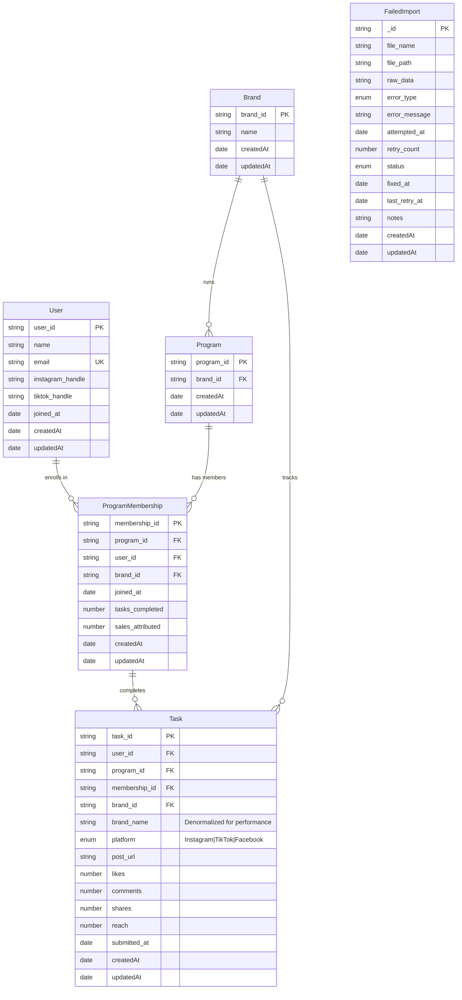
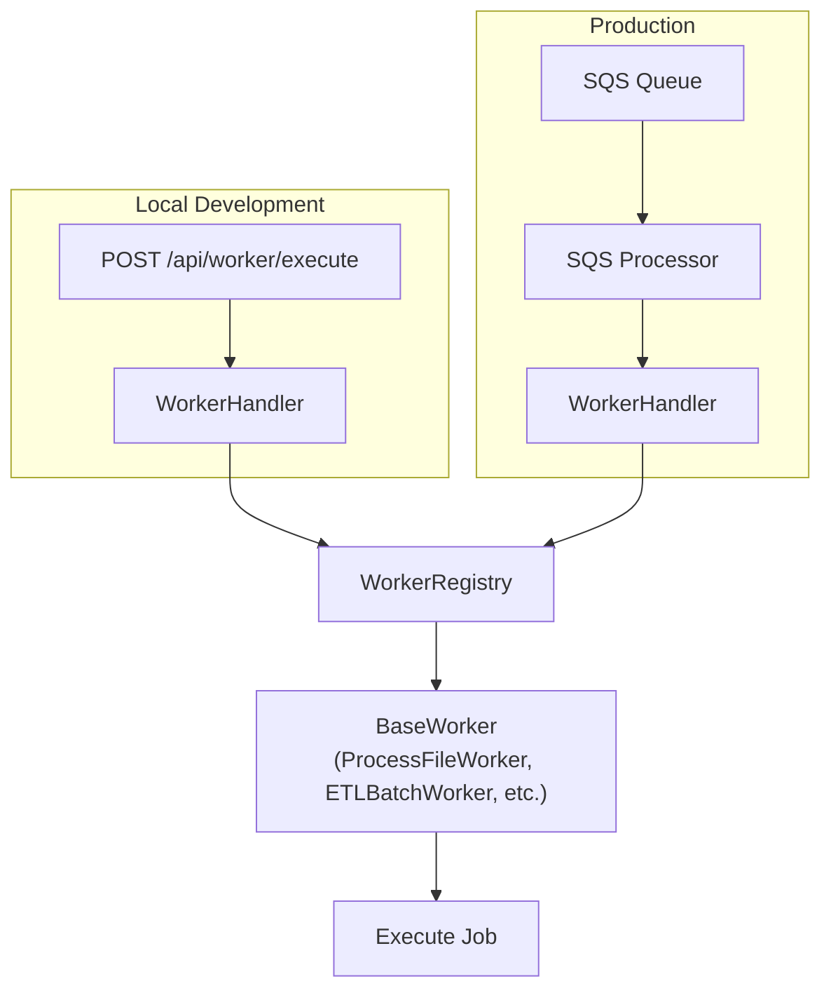

# Advocacy Platform ETL & API


Multi-tier Hapi.js API for processing 10,000 JSON user advocacy files with ETL pipeline and comprehensive failed imports management.

## Quick Start

**Prerequisites:** nvm, MongoDB running locally (or use Docker)

```bash
# 1. Setup
nvm use                # Installs correct Node.js version from .nvmrc
corepack enable
yarn install
cp .env.local .env     # Use working defaults

# 2. Option A: Run with Docker (everything included)
yarn docker:full       # Starts MongoDB + API + Analytics + Admin dashboards

# 2. Option B: Run locally (requires MongoDB)
yarn dev               # API server at http://localhost:3000
cd analytics-dashboard && yarn dev  # Analytics at http://localhost:3001
cd admin-dashboard && yarn dev      # Admin at http://localhost:3002

# 3. Test it works
curl http://localhost:3000/health
```

**Access the dashboards:**
- Analytics Dashboard: http://localhost:3001
- Admin Dashboard: http://localhost:3002


## Initial Analysis

Analyzed patterns before writing ETL code

**Created:** `scripts/analyze-all.js` to systematically scan all 10,000 files

**Tracked:**
- Data quality issues (sentinel values, null fields, type mismatches)
- Field completeness (user, program, task levels)
- Duplicates (user_id, email, program_id)
- Platform distribution
- Structural issues (malformed JSON)

**Key Finding:** Data showed 1:1 user-program pattern (each program_id → one user)

**Design Decision:** Built for 1:N relationship anyway
- Real advocacy platforms have users in multiple programs
- Current data is snapshot, not permanent constraint
- Data model supports `ProgramMembership` junction table
- Enables future: user joins multiple campaigns, cross-program analytics


---

## 1️⃣ Data Exploration & Analysis

**Discovered:**
- 49.7% clean files
- 50.3% messy files
- 222 files (2.2%) malformed JSON

**Decision:** Data quality scoring instead of binary pass/fail
```typescript
data_quality: {
  is_clean: boolean,
  issues: string[],
  severity: 'clean' | 'warning' | 'error'
}
```

**Why:**
- Imports even with warnings (e.g., missing social handles)
- Flags severe errors but stores for manual review
- Complete audit trail, zero data loss

**Trade-off:** More storage for metadata vs. complete recovery path

### Sentinel Value Discovery

**Found:** Errors disguised as data
- `"invalid-email"`, `"???"`, `"#error_handle"`, `"broken_link"`, `"no-data"`, `"NaN"`

**Approach:** Transform to `null` during validation
- Makes validation errors explicit
- Prevents sentinels from polluting analytics
- Zod transformation chains handle this cleanly

### Analysis Results

**Distribution:**
- 100% unique user_ids (when present)
- 99.93% unique emails (4 duplicates)
- 3 major platforms: TikTok, Instagram, Facebook

---

## 2️⃣ Data Processing & Engineering

### 3 Validation Layers

#### Layer 1: JSON Auto-Repair

**Problem:** 222 files missing closing braces

**Solution:** Stack-based bracket balancing
- Tracks opening brackets: `{ [ { [`
- Generates closing: `] } ] }`
- String-aware (skips brackets inside quotes)
- Handles nested structures

**Result:** 100% repair success rate

**Code:** `src/utils/json-repair.ts`

#### Layer 2: Zod Runtime Validation

**Why Zod:**
- Type inference (TypeScript types from schemas)
- Transformation chains (`.transform()` for coercion)
- Custom rules (`.superRefine()` for cross-field validation)

**Type Coercion:**
```typescript
likes: z.coerce.number()           // "150" → 150
  .catch(0)                        // Invalid → 0
  .transform(val => isNaN(val) ? 0 : val)  // NaN → 0
```

**Cross-Field Validation:**
```typescript
.superRefine((data, ctx) => {
  // Can't post to Instagram without Instagram handle
  if (platformsUsed.has('Instagram') && !data.instagram_handle) {
    ctx.addIssue({ message: 'instagram_handle required' })
  }
})
```

**Impact:** Prevented 2,316 logically impossible records

#### Layer 3: Database Constraints

MongoDB unique indexes and required fields as final safety net

### Social Handle Normalization

**Challenge:** `@username`, `USERNAME`, ` username `, `@UserName`

**Solution:** Consistent normalization
- Remove @ prefix
- Trim whitespace
- Convert to lowercase
- Return null if empty

**Why:** Enables deduplication, case-insensitive searches

---

## 3️⃣ Software Engineering & System Design

### ETL Pipeline: Worker Pattern

**Decision:** Reusable workers inheriting from `BaseWorker<TInput, TOutput>`

**Benefits:**
- Reusability (works in API calls AND SQS messages)
- Consistency (error handling, logging, validation)

**Workers Implemented:**
- **ExtractFilesWorker** - Archive extraction, cleanup, AppleDouble filtering
- **ProcessFileWorker** - Single file ETL (read → parse → validate → transform → load)
- **ETLBatchWorker** - Batch processing with concurrency

**Trade-off:** Upfront abstraction vs. easy extensibility

Unified worker system for both local development (API calls) and production (SQS messages):



### Multi-Tier API Architecture

**Problem:** Different deployments need different routes

**Solution:** Environment-based route exposure
```bash
ENABLE_ADMIN_ROUTES=true    # Failed imports management
ENABLE_WORKER_ROUTES=true   # ETL job triggers
ENABLE_WEB_ROUTES=true      # Public analytics
```

Deployment modes:
- Development: All routes enabled
- Production Admin Tier: Admin routes only (internal network)
- Production Worker Tier: Worker routes only (queue consumer)
- Production Web Tier: Web routes only (public API)

Single codebase, multiple deployment modes

### Failed Imports: Zero Data Loss

**Decision:** Never discard failed records

**Schema:**
```typescript
{
  file_name, raw_data,        // Original preserved
  error_type, error_message,  // What went wrong
  retry_count, status,        // Recovery tracking
  notes                       // Admin notes
}
```

**Features:**
- REST API for managing failed imports
- Edit raw JSON in UI, retry with validation
- Complete audit trail

**Workflow:**
1. Import fails → saved with raw JSON
2. Admin views in dashboard, edits JSON
3. Clicks "Retry" → re-validates
4. Marks as fixed if successful

### Database Migrations (Not Decorators)

**Decision:** Explicit migration files for indexes

**Why:**
- Control (no surprises)
- Rollback capability
- Documentation (WHY indexes exist)
- Production safety

**Implemented:** 10 migrations (7 collections + 3 optimizations)

**Trade-off:** More boilerplate vs. zero accidental changes

### Testing Strategy

**Test coverage:**
- Zod schemas - Transformations, cross-field validation, coercion
- AnalyticsService - 120 test cases
- JSON repair - Edge cases (nested, escaped, strings)
- ProcessFileWorker - ETL workflow, error handling

**CI/CD:** GitHub Actions (typecheck, lint, test, build) + pre-push hook

---

## 4️⃣ Insights & Visualizations

### AnalyticsService

**Design:** MongoDB aggregation pipelines (not application-layer)

**Why:**
- Performance (database does heavy lifting)
- Scalability (works with 10k or 10M records)
- Accuracy (single source of truth)

**Trade-off:**
- Current: Queries operational models directly (users, tasks, programs)
- Ideal: Separate analytics models optimized for querying
- Would enable: Pre-aggregated metrics, faster queries, independent scaling
- Cost: Increased complexity, data sync overhead

### Dashboards

**Analytics Dashboard (React + ECharts):**
- Brand performance (engagement, sales, brand-platform heatmap)
- User influence (top advocates, drill-down to individual)
- Platform comparison (TikTok vs Instagram vs Facebook)
- Program ROI (sales per task, per advocate)

**Admin Dashboard (React Admin):**
- Failed imports management (edit JSON, retry, bulk actions)
- CRUD on all entities (users, brands, programs, tasks)
- Worker job triggers

**Tech Choice:** ECharts (not D3)
- Declarative config (easier)
- Responsive (auto-resize)

---

## 5️⃣ Performance Optimization & Automation

### Database Indexes

**Unique Constraints:**
- users: `user_id`, `email`
- tasks: `task_id`
- brands: `brand_id`
- programs: `program_id`
- program_memberships: `membership_id`, `(user_id, program_id)`

**Compound Indexes for Analytics:**
- tasks: `(user_id, submitted_at)` - user task history with sorting
- tasks: `(brand_id, platform)` - brand-platform cross-analytics
- program_memberships: `(user_id, program_id)` - membership lookups

**Denormalization:**
- Stored `brand_name` directly in tasks collection
- Eliminates joins for analytics queries
- Historical accuracy (name at task creation time)

### Redundant Indexes Removed

**Found:** 3 standalone indexes redundant with compound indexes

**MongoDB Prefix Rule:** Compound index `(A, B)` serves queries on `A` alone

**Example:**
```
Redundant: tasks.brand_id_index
Covered by: tasks.brand_platform_index (brand_id, platform)
```

**Action:** Migration to drop 3 indexes

**Result:**
- Storage savings
- Faster writes
- No read performance loss

### Problem 3: Slow ETL

**Solution:** Batch processing + concurrency

**Config:**
- Batch size: 100 files
- Concurrency: 5 parallel workers

**Result:** Much faster processing with controlled memory usage

**Trade-off:** Higher memory usage, controlled by batch size


### CI/CD Automation

**GitHub Actions:**
- Type checking (tsc --noEmit)
- Linting (eslint)
- Testing + coverage (jest + MongoDB container)
- Build verification
- Coverage upload (Codecov)

**Pre-Push Hook:** Same checks locally (faster feedback)

### Docker: Multi-Service Setup

**4 Services:** MongoDB, API, Analytics Dashboard, Admin Dashboard

**Profile-Based:**
- `full` - Complete stack (demos)
- `api` - MongoDB + API (backend dev)
- `dashboards` - API + dashboards (frontend dev)
- `minimal` - MongoDB only (local dev)

**Why Profiles:** Flexible deployment, faster startup

---

## Key Design Decisions Summary

### Data Model
- **Built for 1:N user-program** despite data showing 1:1
  - Real advocacy platforms support multiple programs per user
  - Current data = snapshot, not constraint
  - ProgramMembership junction table enables future analytics

### Validation Strategy
- **3-layer validation** (JSON repair → Zod runtime → DB constraints)
  - Each layer catches different error types
  - Fail fast at right level (structural → semantic → referential)

### Performance
- **Denormalization over normalization** (brand_name in tasks)
  - Major query speedup for minimal storage cost
  - Historical accuracy (name at creation time)

### Error Handling
- **Save everything, discard nothing** (failed imports)
  - Complete audit trail
  - Manual recovery path
  - Zero data loss

### Architecture
- **Single codebase, multiple tiers** (environment-based routes)
  - Independent scaling

### Testing
- **Test business logic, trust framework**
  - Focus on complex (schemas, aggregations, repair logic)
  - Integration test MongoDB queries
  - CI/CD catches regressions

---

## What I'd Do With More Time

- Email-based merge recovery for failed imports
- Auth & authorization (enables user-level analytics)
- Advanced analytics models (separate read models, pre-aggregated metrics)
- S3 storage adapter for cloud-scale processing
- SQS for async ETL processing
- Production logging and monitoring
- Expanded testing

---

## Acknowledgments

This project was built with assistance from my intern **[Claude Code](https://claude.com/claude-code)**.
